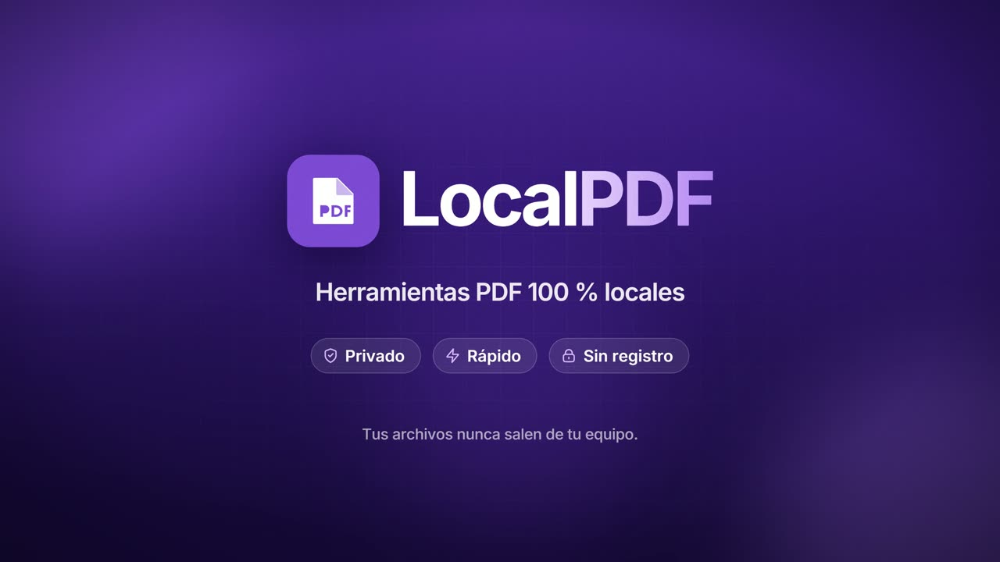
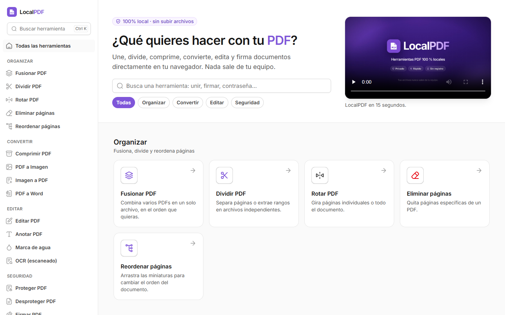
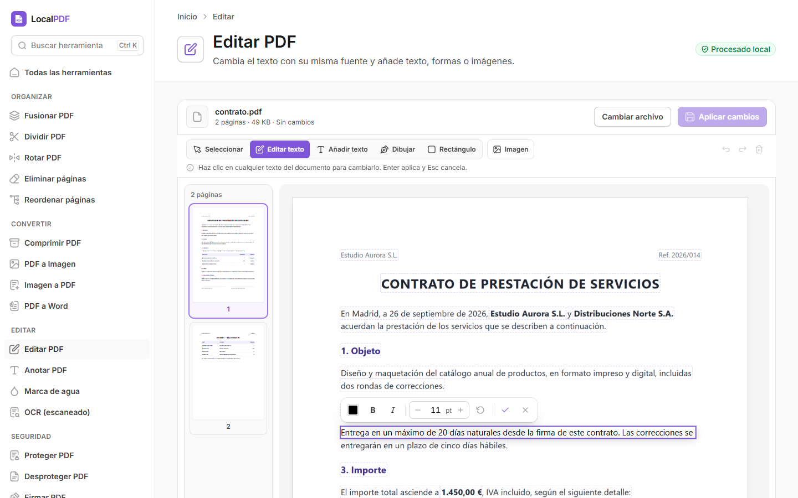
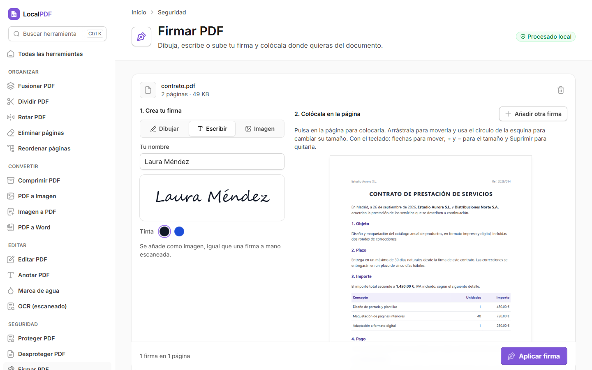
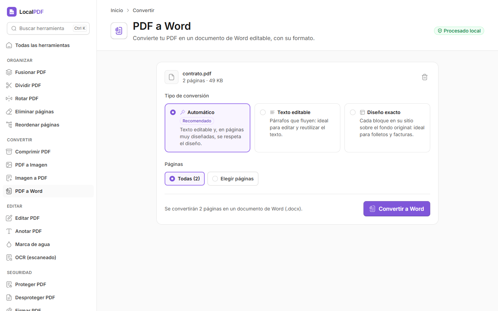
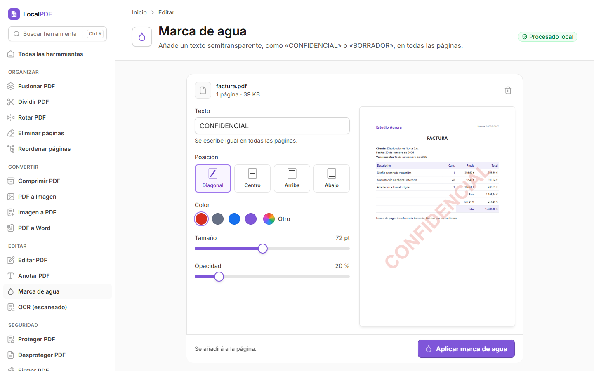
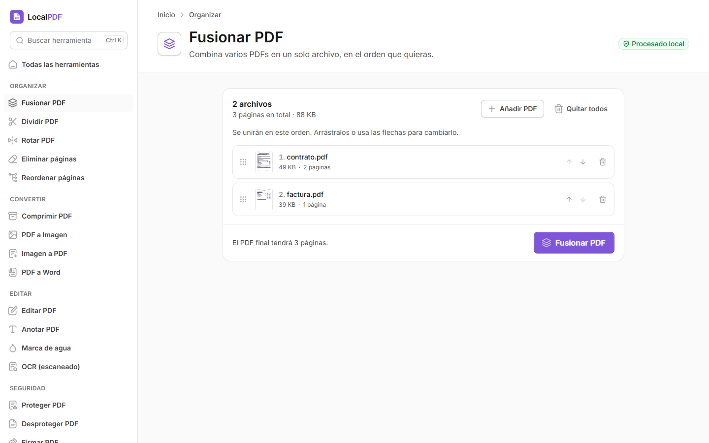
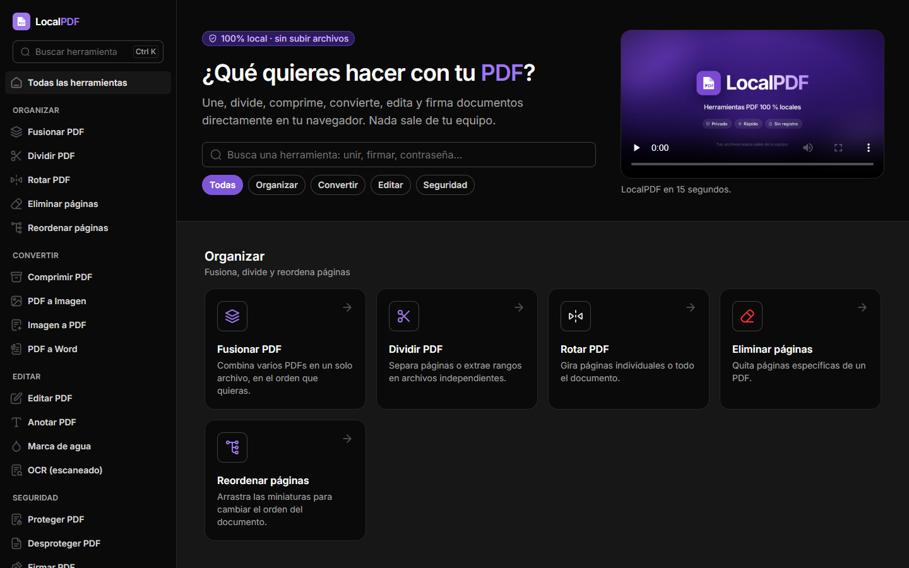
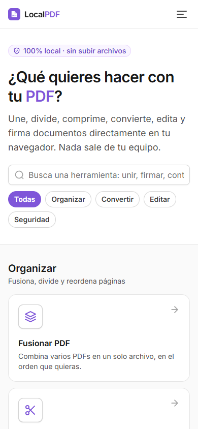

# LocalPDF

Herramientas PDF de código abierto que funcionan 100 % en el navegador: los archivos nunca salen del equipo.

[](public/video/localpdf-demo.mp4)

Incluye: fusionar, dividir, rotar, eliminar y reordenar páginas, comprimir, PDF a imagen, imagen a PDF, PDF a Word
(.docx editable con su formato, tablas e imágenes), editar el texto del PDF (con la misma fuente, tamaño y color), anotar,
marca de agua, OCR de documentos escaneados, proteger y desproteger con contraseña, firmar y censurar.

No hay servidor que procese documentos: todo se ejecuta con JavaScript en el navegador de quien usa la página, así que
se puede publicar como un sitio estático (ver [Publicar en Netlify](#publicar-en-netlify)).

[](https://app.netlify.com/start/deploy?repository=https://github.com/ramon3198/localpdf)

## Capturas



| | |
| --- | --- |
|  |  |
| **Editar PDF**: cambia el texto con su misma fuente, tamaño y color. | **Firmar PDF**: dibuja, escribe o sube tu firma y colócala. |
|  |  |
| **PDF a Word**: .docx editable con su formato, tablas e imágenes. | **Marca de agua**: con vista previa en vivo. |
|  |  |
| **Fusionar PDF**: arrastra para cambiar el orden. | **Modo oscuro** automático o manual. |

<p align="center"><br>También funciona en el móvil.</p>

## Requisitos

- **Node.js 22.13 o superior** (la versión LTS actual sirve): <https://nodejs.org>
- **Internet para instalar y compilar**: se descargan las dependencias y, en cada compilación, la fuente Inter.
- **OCR** (y el OCR opcional de «PDF a Word») necesita internet: descarga su motor y los datos de idioma desde
  cdn.jsdelivr.net. El resto de herramientas funciona sin conexión.

Para comprobar la versión de Node: `node --version`

## Descargar

Con git:

```bash
git clone https://github.com/ramon3198/localpdf.git
```

O sin git: en GitHub pulsa **Code → Download ZIP** y descomprímelo.

## Arranque rápido en Windows

1. Abre la carpeta del proyecto (la que contiene `iniciar.bat`). Si la descargaste en ZIP, descomprímela antes (clic
   derecho → **Extraer todo**).
2. Doble clic en **`iniciar.bat`**. Si Windows muestra "Windows protegió su PC", pulsa **Más información** →
   **Ejecutar de todas formas**.
3. La primera vez instala las dependencias y compila (unos minutos). Después se abre el navegador en
   <http://localhost:3000>.

Para detener LocalPDF, cierra la ventana negra. Si el puerto 3000 está ocupado, cambia `PORT` al principio de
`iniciar.bat`.

## Arranque manual (Windows, macOS o Linux)

Abre una terminal en la carpeta LocalPDF. En Windows usa el **Símbolo del sistema** (cmd): en PowerShell, `npm`
puede estar bloqueado por la política de scripts (usa `npm.cmd` en lugar de `npm`).

```bash
npm ci
npm run build
npm start
```

1. `npm ci` instala las dependencias exactas de `package-lock.json` (solo la primera vez).
2. `npm run build` compila la versión de producción (repítelo cada vez que cambie el código).
3. `npm start` sirve la aplicación en <http://localhost:3000>, solo para este equipo.

Para detenerla, pulsa **Ctrl+C** en la terminal. Para usar otro puerto (funciona en cualquier terminal):

```bash
npx next start -H 127.0.0.1 -p 8080
```

## Publicar en Netlify

El repositorio ya trae `netlify.toml`: compila con `npm run build:static` (Next.js genera un sitio estático en `out/`)
y publica esa carpeta, sin funciones de servidor.

1. En <https://app.netlify.com> elige **Add new site → Import an existing project → GitHub** y selecciona el repositorio
   (o usa el botón **Deploy to Netlify** de arriba).
2. Deja la configuración que detecta Netlify y pulsa **Deploy**. Cada `git push` vuelve a publicar la web.

Para generar el sitio estático en tu equipo:

```bash
npm run build:static
```

La carpeta `out/` se puede subir a cualquier hosting estático (Netlify Drop, GitHub Pages en un dominio propio,
Cloudflare Pages…).

## Modo desarrollo

```bash
npm run dev
```

Abre la dirección que aparece en la línea `Local:` de la terminal (normalmente <http://localhost:3000>). La página se
recarga sola al guardar cambios. El aviso "Experiments: optimizePackageImports" es normal.

## Pruebas

```bash
npm run test:engine
```

Autoprueba del motor que edita el texto de los PDF. Debe terminar con `all checks passed`.

Utilidades para desarrolladores en `scripts/`:

- `engine-test.mjs`: aplica una edición a un PDF desde la terminal. Antes compila el motor con `npm run engine:build`.

  ```bash
  node scripts/engine-test.mjs entrada.pdf salida.pdf 1 "texto actual" "texto nuevo"
  ```

  Las páginas empiezan en 1. En la salida, `"ok": true` significa que la edición se aplicó; `partial` indica que solo
  cambió parte de la línea y `fallbackChars` cuántos caracteres usaron una fuente de sustitución.

- `engine-verify.py`: comprueba un PDF editado con otro lector (MuPDF) y guarda recortes de las líneas editadas.
  Requiere Python y `pip install pymupdf`.

  ```bash
  python scripts/engine-verify.py original.pdf editado.pdf 1 carpeta-salida "texto actual" "texto nuevo"
  ```

  Resultado esperado: `old_still_extractable: false`, `new_extractable: true` y `pixels_changed_outside_edited_lines: 0`.

- `build-font-pack.py`: vuelve a descargar las fuentes de `public/fonts/pack` (las reemplaza). Requiere internet,
  Python y `pip install fonttools`.
- `pdf-to-docx-check.mjs`: banco de pruebas de «PDF a Word». Convierte PDFs y, con `--word`, abre cada .docx con
  Microsoft Word para compararlo con el original (requiere Windows con Word, Python con `pymupdf` y `python-docx`).
  Uso: `node scripts/pdf-to-docx-check.mjs --help`.

## Estructura

| Carpeta | Contenido |
| --- | --- |
| `src/app/` | Páginas de la aplicación; cada herramienta está en `src/app/tools/<herramienta>/` |
| `src/lib/pdf-text-engine/` | Motor que edita el texto directamente dentro del PDF |
| `src/components/` | Componentes de interfaz (basados en Untitled UI) |
| `public/fonts/pack/` | Fuentes de sustitución que usa el editor |
| `scripts/` | Pruebas y utilidades |

## Licencia

[MIT](LICENSE). Las fuentes de `public/fonts/pack/` conservan sus propias licencias libres (OFL, Apache y DejaVu):
ver [LICENSES.md](public/fonts/pack/LICENSES.md). La interfaz parte de [Untitled UI React](https://www.untitledui.com)
(MIT).

## Problemas comunes

- **"npm no se reconoce como un comando"**: instala Node.js y abre una terminal nueva.
- **"No se puede cargar el archivo npm.ps1 … la ejecución de scripts está deshabilitada"** (PowerShell): usa el Símbolo
  del sistema, o escribe `npm.cmd` en lugar de `npm`.
- **El puerto ya está en uso**: elige otro, por ejemplo `npx next start -H 127.0.0.1 -p 8080`, o cambia `PORT` en
  `iniciar.bat`.
- **No se ven los cambios del código con `npm start`**: vuelve a ejecutar `npm run build`. Con `iniciar.bat`, borra la
  carpeta `.next` para que compile de nuevo.
- **Error al instalar con `npm ci`**: comprueba que tienes Node.js 22.13 o superior y conexión a internet.
